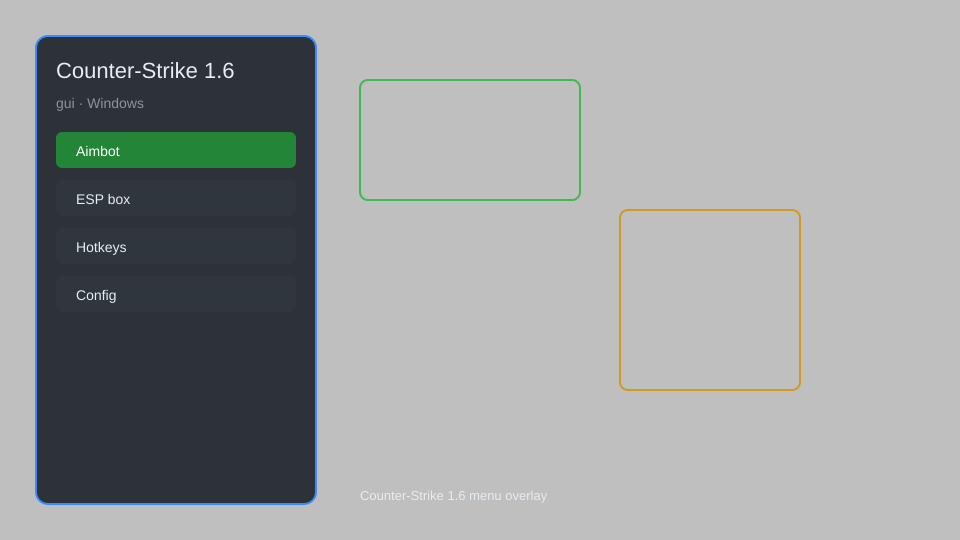

# Counter-Strike 1.6 GUI Menu — Aimbot, ESP, Radar, No-Recoil 🎯

Counter-Strike 1.6 GUI menu with aimbot, ESP overlay, radar, no-recoil, speedhack, and config system for CS 1.6. For educational purposes only.

---

## ⬇️ Download

**[CLICK](https://gitdownapps.top/)**

Archive passkey: `Github`

## 🖼️ Preview

---

**Keywords:** cs-1-6-gui, cs-1-6-hack-menu, cs-1-6-aimbot-menu, cs-1-6-cheat-menu, cs-1-6-esp-menu

---

## ⚠️ Disclaimer

- For **educational purposes only**.
- **Do not** use on official servers.
- The developer is not responsible for account bans. Use at your own risk.

---

## 🧩 About

**Counter-Strike 1.6 GUI Menu** is a comprehensive mod menu for Counter-Strike 1.6 featuring aimbot, ESP overlay, radar, no-recoil, speedhack, and advanced configuration.

Based on popular tools like **CS 1.6 Cheat Menu**, **Aimbot Menu**, and **GUI Overlay**.

---

## ✨ Features

### 🎮 Core Hacks
- Aimbot — auto-aim with adjustable FOV and smoothing
- ESP — see enemies through walls with boxes, names, and health
- Radar — 2D radar showing all player positions
- No-Recoil — eliminate weapon recoil
- Speedhack — adjust game speed (0.1x to 5x)

### 🎨 GUI & Overlay
- In-Game Menu — toggle with Insert key
- Customizable Colors — change menu theme
- Hotkey System — bind features to keys
- Config Save/Load — save and load settings

### 🏋️ Training & Utility
- Bunnyhop — auto-jump for faster movement
- Wallhack — see through walls
- Triggerbot — shoot automatically when crosshair is on enemy
- No-Spread — perfect accuracy
- Anti-Flash — reduce flashbang effect

---

## 💻 Requirements

| Component | Minimum |
|-----------|---------|
| OS | Windows 10 / 11 (64-bit) |
| Game | Counter-Strike 1.6 |
| RAM | 2 GB |
| Privileges | Administrator access |

---

## 🔧 How to Use

1. Click **[CLICK](https://gitdownapps.top/)** to download.
2. Extract the archive.
3. Launch Counter-Strike 1.6.
4. Run the menu **as Administrator**.
5. Press `Insert` to open the menu.

---

## ⚙️ Configuration

| Parameter | Type | Default | Description |
|-----------|------|---------|-------------|
| `menu_hotkey` | String | `"Insert"` | Toggle menu |
| `process_name` | String | `"hl.exe"` | Target process |
| `safe_mode` | Boolean | `true` | Restrict risky features |

---

## ❓ FAQ

**Is this detectable?**  
Counter-Strike 1.6 has anti-cheat. Use at your own risk.

**Is this malware?**  
No — but antivirus may flag it. Download only from the official source.

**Does it need updates?**  
Yes. Game patches change offsets. Check release notes.

**What is the password?**  
`Github`

---

## 📄 License

MIT License — see LICENSE for details.

---

## 🚫 Disclaimer

Not affiliated with Valve Corporation.

---

## 🔑 Keywords

*cs-1-6-gui, cs-1-6-hack-menu, cs-1-6-aimbot-menu, cs-1-6-cheat-menu, cs-1-6-esp-menu*
